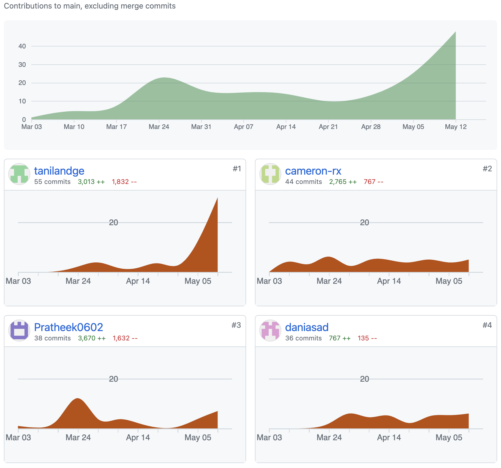

# Plant Identification Web App 
## Installation
To install the application, follow these steps:

1. Clone the repository from GitHub:
    git clone git@github.com:Pratheek0602/intelligent_web.git

2. Navigate into the project directory:
    cd intelligent_web

3. Install the required dependencies using npm:
    npm install

4. To run the application start your mongodb server based on your operating system then run:
    npm start
    
To view the website visit http://localhost:3000/ in your browser

## Github history and source

Source: https://github.com/Pratheek0602/intelligent_web

History:

    
