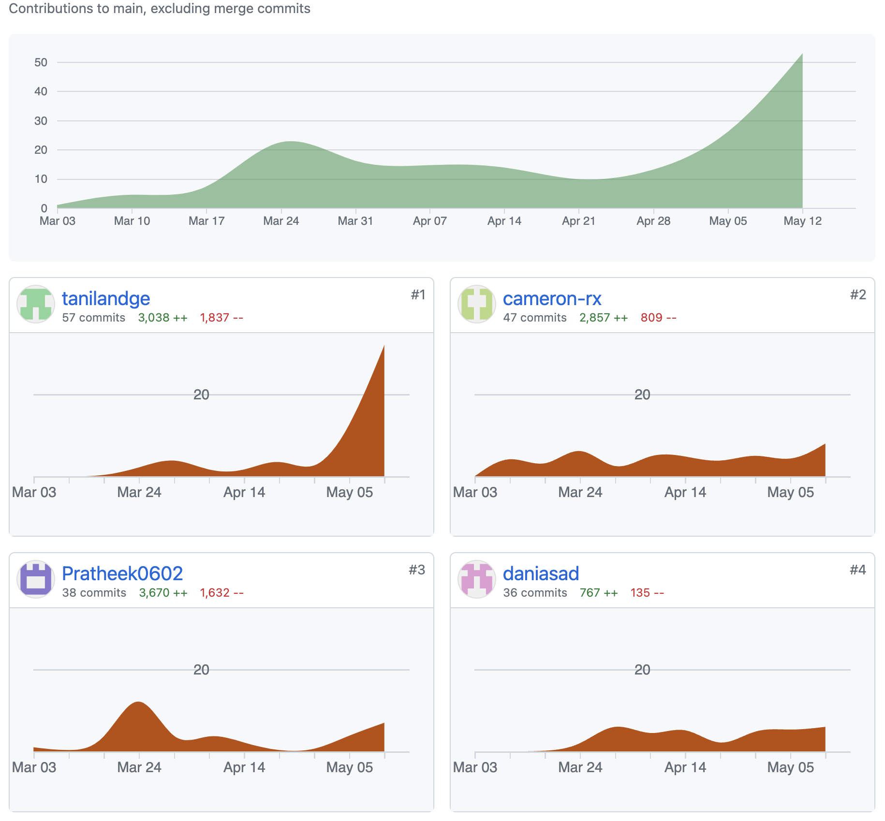

# Plant Identification Web App 
## Installation
To install the application, follow these steps:

1. Clone the repository from GitHub:
    git clone git@github.com:Pratheek0602/intelligent_web.git

2. Navigate into the project directory:
    cd intelligent_web

3. Install the required dependencies using npm:
    npm install

## Starting the Application
Once the installation is complete, you can start the application using the following command:
npm start

